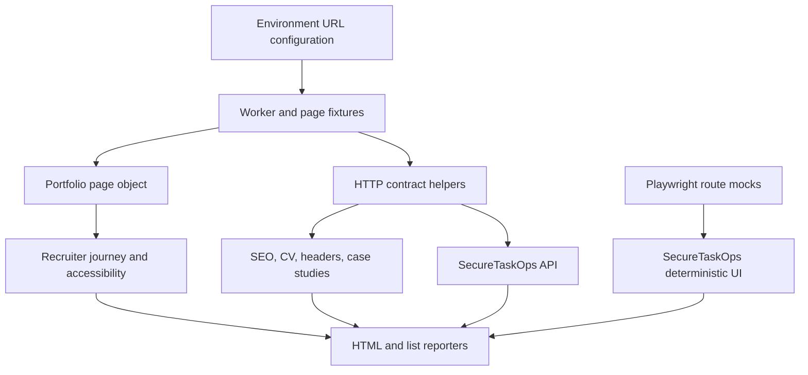

# Architecture

## Purpose

QA Automation Lab verifies public release boundaries across independently deployed products. It deliberately keeps deep domain tests in the owning repositories and tests only contracts that a recruiter, release check, or public client can observe here.

## Suite Boundaries

## Execution Modes

| Mode | Target | Writes | Browser required | Purpose |
| --- | --- | --- | --- | --- |
| Public contract | Live portfolio and products | No | Yes | Recruiter path, metadata, accessibility, release boundaries |
| Live API smoke | Deployed SecureTaskOps | No | No | Availability and response-shape regression |
| Local target | Fresh SecureTaskOps process | Opt-in | Yes | Negative cases, creation flow, deterministic UI |

## Failure Evidence

Playwright stores results under `test-results/` and the HTML report under `playwright-report/`. CI uploads both for 14 days. Traces, screenshots, and video are retained only on failure to keep routine runs small.

## Security Boundary

The suite uses public endpoints only and contains no credentials. Mutation tests are gated by `QA_ALLOW_WRITES=1` and are not enabled in the shared live job. GitHub Actions permissions are read-only.
