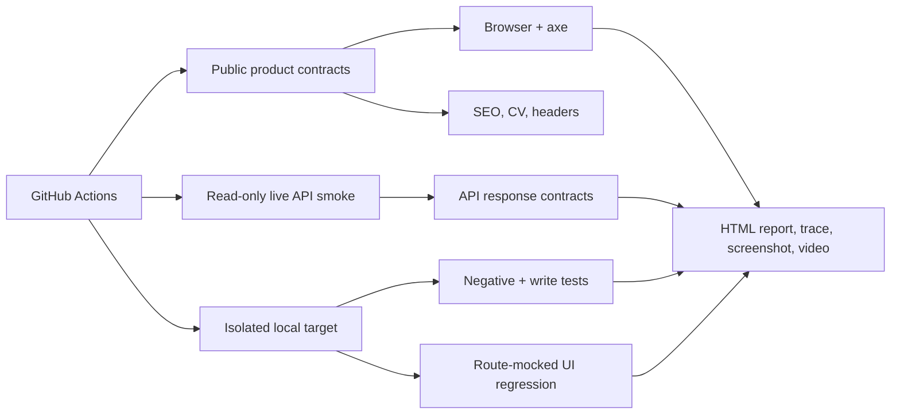

# QA Automation Lab

[](https://github.com/Assembler-Fourier/qa-automation-lab/actions/workflows/ci.yml)

Playwright release-contract suite for public portfolio evidence and a small workflow API. It combines browser checks, API contracts, deterministic network mocks, accessibility scanning, and CI evidence without requiring private accounts or production credentials.

## What It Proves

- Browser-level recruiter journeys with role-based locators and a small page object.
- API response, validation, filtering, and consistency contracts.
- Read-only smoke tests against shared live deployments.
- Opt-in write tests against an isolated local target.
- Data-driven project and filter coverage.
- Deterministic UI regression tests using Playwright route interception.
- Critical accessibility checks with axe-core.
- CI retries, parallel workers, failure traces, screenshots, video, and HTML reports.

This is a focused public QA portfolio, not a substitute for each product's private or repository-owned test suite.

## Coverage Matrix

| Surface | Test level | Evidence |
| --- | --- | --- |
| [Portfolio](https://uzairwaseem.com) | Browser smoke, accessibility, metadata, CV, sitemap, 404, case-study contracts | `portfolio-ui.spec.mjs`, `portfolio-products.spec.mjs` |
| [Roster Command](https://employee-roster-command.vercel.app/?demo=1) | Authentication/recruiter-demo boundary and security headers | `live-products.spec.mjs` |
| [HouseFair](https://housemates-sand.vercel.app) | Public availability, identity, and browser security headers | `live-products.spec.mjs` |
| [Irish Theory Test Coach](https://irishtheorycoach.ie) | Custom-domain canonical, disclaimer, and security headers | `live-products.spec.mjs` |
| [SecureTaskOps](https://securetaskops-workflow-platform.vercel.app) | API smoke/regression plus mocked browser workflow | `securetaskops-api.spec.mjs`, `securetaskops-ui.spec.mjs` |

## Design



The live suite never writes to shared deployments. `QA_ALLOW_WRITES=1` is required for mutation tests and CI only sets it while running a fresh local SecureTaskOps process.

## Stable Test Practices

- Browser tests prefer accessible roles, labels, and durable IDs over layout-dependent selectors.
- Page objects contain navigation and reusable workflow operations, not assertions for every detail.
- API helpers add status/body context to failures.
- Test data uses unique titles and dynamic dates.
- Route-mocked UI tests isolate rendering from deployment and data volatility.
- There are no arbitrary sleeps; tests wait for requests, locators, or health endpoints.
- CI retries once and retains the first failure evidence instead of hiding persistent failures.

Authentication-state reuse is not demonstrated because the public targets intentionally expose no test account. Adding a fake login fixture would be misleading; a real authenticated target should use a dedicated non-production account and Playwright `storageState` setup.

## Local Setup

```bash
npm ci
npx playwright install chromium
npm run check
npm test
```

`npm test` runs the public portfolio/product contracts and is safe on any machine. It does not assume that port 3000 contains SecureTaskOps.

Run read-only API checks against the deployed target:

```bash
QA_BASE_URL=https://securetaskops-workflow-platform.vercel.app npm run test:securetaskops:read
```

Run the complete SecureTaskOps suite against a local checkout listening on port 3000:

```bash
QA_BASE_URL=http://127.0.0.1:3000 QA_ALLOW_WRITES=1 npm run test:securetaskops
```

PowerShell:

```powershell
$env:QA_BASE_URL = "http://127.0.0.1:3000"
$env:QA_ALLOW_WRITES = "1"
npm run test:securetaskops
```

Supported public URL overrides: `PORTFOLIO_URL`, `ROSTER_URL`, `HOUSEFAIR_URL`, and `THEORY_URL`.

## Failure Investigation

1. Read the list reporter output and identify whether the failure is local, live, or public-contract scope.
2. Open `playwright-report/index.html` locally or download the named CI artifact.
3. Inspect retained traces, screenshots, video, response status/body context, and `target-app.log`.
4. Re-run the narrow script before the full suite.
5. Treat repeated external deployment failures as release-boundary incidents, not as reasons to weaken assertions.

See [Test Strategy](docs/TEST_STRATEGY.md) and [Failure Triage](docs/FAILURE_TRIAGE.md) for details.

## Known Limitations

- Public checks cannot verify private accounts, database isolation, payment settlement, or operational data.
- Automated axe checks do not replace keyboard, screen-reader, zoom, and contrast review.
- The SecureTaskOps live job is a read-only smoke suite; writable behavior is verified locally.
- Deployment availability can fail independently of application code.
- Product-owned unit, integration, security, and browser suites remain the main source of deep coverage.
